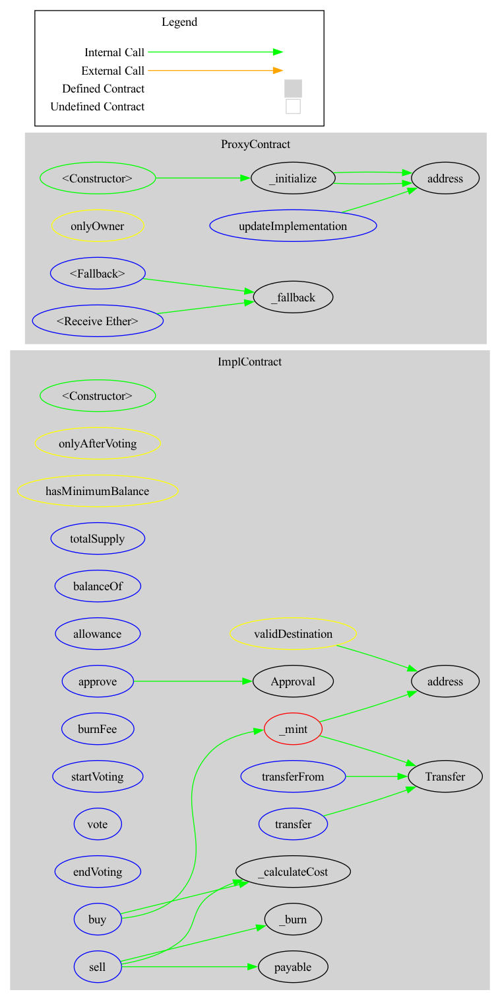

# Voting token

## Contracts Description Table

|      Contract      |         Type          |    Bases     |            |                                  |
|:------------------:|:---------------------:|:------------:|:----------:|:--------------------------------:|
|         L          |     Function Name     |  Visibility  | Mutability |            Modifiers             |
| **Implementation** |                       |              |            |                                  |
|         L          |      totalSupply      |  External❗️  |            |                NO                |
|         L          |       balanceOf       |  External❗️  |            |                NO                |
|         L          |       transfer        |  External❗️  |     🛑     | onlyAfterVoting,validDestination |
|         L          |       allowance       |  External❗️  |            |                NO                |
|         L          |        approve        |  External❗️  |     🛑     |         validDestination         |
|         L          |     transferFrom      |  External❗️  |     🛑     | onlyAfterVoting,validDestination |
|         L          |         _mint         | Private🔒 ️  |            |                NO                |
|         L          |         _burn         | Private🔒 ️  |            |                NO                |
|         L          |    _calculateCost     | Private🔒 ️  |            |                NO                |
|         L          |        burnFee        | External❗ ️  |     🛑     |                NO                |
|         L          |      startVoting      | External❗ ️  |     🛑     |        hasMinimumBalance         |
|         L          |         vote          | External❗ ️  |     🛑     |        hasMinimumBalance         |
|         L          |          buy          | External❗  ️ |     💵     |                NO                |
|         L          |         sell          | External❗  ️ |     💵     |         onlyAfterVoting          |
|                    |                       |      ️       |            |                                  |
| **ProxyContract**  |                       |      ️       |            |                                  |
|         L          |      _initialize      |  ️Private🔒  |            |                NO                |
|         L          |       _fallback       |  ️Private🔒  |     💵     |                NO                |
|         L          | _updateImplementation |  ️External❗  |     🛑     |            onlyOwner             |

### Legend

| Symbol | Meaning                   |
| :----: | ------------------------- |
|   🛑   | Function can modify state |
|   💵   | Function is payable       |

## Inheritance graph

